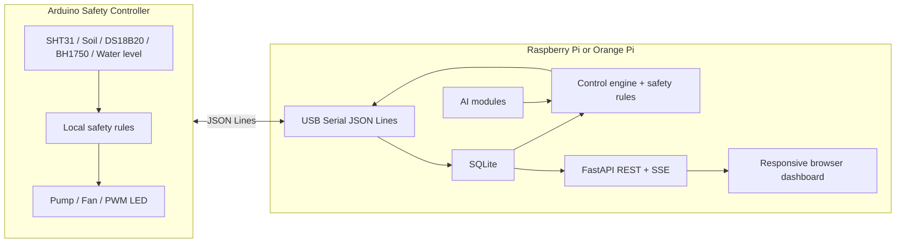

# Cherry Tomato AI Smart Farm

Arduino + Raspberry Pi/Orange Pi 기반의 방울토마토용 AI 보조 자동 관리 스마트팜 MVP입니다.

핵심 원칙은 단순합니다.

- 생존/안전 제어는 항상 rule-based 로직이 우선입니다.
- AI는 관수 추천, 병해 의심, 이상 패턴 탐지처럼 판단을 보조합니다.
- AI 추천은 `safety_rules`와 Arduino 자체 안전 로직을 모두 통과해야 액추에이터 명령으로 반영됩니다.

## 1. 전체 아키텍처



Arduino는 센서 수집, 액추에이터 구동, 물탱크/펌프 시간 제한 같은 독립 안전 제어를 담당합니다. Pi/Orange Pi는 데이터 저장, API, 대시보드, AI 추론, 알림, 상위 제어 판단을 담당합니다. 모바일 앱은 별도 네이티브 앱 대신 같은 FastAPI 서버의 반응형 웹 대시보드로 시작합니다.

## 2. 디렉토리/파일 구조

```text
.
├── README.md
├── arduino/
│   └── smartfarm_controller/
│       └── smartfarm_controller.ino
├── raspberry_pi/
│   ├── requirements.txt
│   ├── systemd/
│   │   └── smartfarm.service
│   └── app/
│       ├── __init__.py
│       ├── config.py
│       ├── database.py
│       ├── main.py
│       ├── schemas.sql
│       ├── ai/
│       │   ├── __init__.py
│       │   ├── anomaly_detector.py
│       │   ├── disease_model.py
│       │   └── irrigation_model.py
│       ├── control/
│       │   ├── __init__.py
│       │   ├── engine.py
│       │   └── safety_rules.py
│       ├── serial_comm/
│       │   ├── __init__.py
│       │   └── serial_client.py
│       ├── static/
│       │   ├── app.js
│       │   └── styles.css
│       └── templates/
│           └── index.html
```

## 3. 센서/하드웨어 정보

이 프로젝트는 Arduino를 하드웨어 안전 컨트롤러로 두고, Raspberry Pi/Orange Pi는 저장/대시보드/AI 판단을 담당하는 구조입니다. 아래 센서들은 Arduino에서 직접 읽고 JSON Lines로 Pi에 전송합니다.

### 필수 센서

| 센서 | 측정값 | 연결 방식 | 코드/DB 필드 | 사용 목적 |
| --- | --- | --- | --- | --- |
| SHT31 | 공기 온도, 공기 습도 | I2C | `air_temp`, `air_humidity` | 팬 제어, 증산 스트레스 판단, 관수 추천 입력 |
| 정전용량식 토양 수분 센서 | 토양 수분율 | Analog | `soil_moisture` | 관수 판단의 핵심 입력 |
| DS18B20 | 토양/뿌리 온도 | 1-Wire | `soil_temp` | 뿌리 활착 환경 확인, 이상 감지 |
| BH1750 | 조도 lux | I2C | `light_lux` | LED 보광 판단, 일조량 추정 |
| 수위 센서 | 물탱크 수위 `ok`/`low` | Digital | `water_level` | 펌프 공회전 방지, 안전 lockout |

### 선택 센서

| 센서 | 측정값 | 연결 방식 | 코드/DB 필드 | 사용 목적 |
| --- | --- | --- | --- | --- |
| pH 센서 | 배양액/토양 용액 산도 | Analog 또는 UART 모듈 | `ph` | 양분 흡수 환경 모니터링 |
| EC 센서 | 전기전도도, 비료 농도 | Analog 또는 UART 모듈 | `ec` | 과비/비료 부족 추정 |
| MH-Z19B | CO2 ppm | UART | `co2` | 환기/광합성 환경 분석 |

### 현재 펌웨어 기준 핀 배치

| 항목 | 기본 핀 | 비고 |
| --- | --- | --- |
| 정전용량식 토양 수분 | `A0` | `SOIL_ADC_DRY`, `SOIL_ADC_WET` 보정 필수 |
| 수위 센서 | `D2` | 예제 코드는 `INPUT_PULLUP`, `LOW = ok` 기준 |
| DS18B20 | `D3` | 데이터 라인에 4.7kΩ pull-up 권장 |
| 펌프 제어 | `D5` | 릴레이 또는 MOSFET 구동 |
| 팬 제어 | `D6` | 릴레이 또는 MOSFET 구동 |
| LED PWM | `D9` | MOSFET + PWM 밝기 제어 권장 |
| SHT31 | I2C SDA/SCL | 보통 주소 `0x44` |
| BH1750 | I2C SDA/SCL | SHT31과 같은 I2C 버스 공유 가능 |

### 센서별 주의사항

- SHT31: 온실 내부의 직사광선이나 LED 빛을 직접 맞으면 실제 공기 온도보다 높게 나올 수 있습니다. 작은 차광 커버를 두고 공기가 통하는 위치에 설치하세요.
- 토양 수분 센서: 센서마다 ADC 범위가 다릅니다. 마른 흙과 충분히 젖은 흙에서 값을 측정한 뒤 `SOIL_ADC_DRY`, `SOIL_ADC_WET`를 반드시 수정하세요.
- DS18B20: 방수형 프로브를 쓰더라도 연결부는 수축튜브/실리콘으로 방수 처리하세요. 값이 `-127 C` 또는 비정상 값이면 배선/풀업 저항 문제일 가능성이 큽니다.
- BH1750: 조도 센서는 잎 위쪽 또는 광원이 닿는 대표 위치에 설치하세요. LED 보광 판단에는 순간 lux보다 일정 시간 평균값이 더 안정적입니다.
- 수위 센서: 이 센서는 안전 로직의 최우선 입력입니다. `water_level == "low"`이면 Pi와 Arduino 양쪽에서 펌프를 막도록 설계했습니다.
- pH/EC 센서: 저가형 analog 보드는 온도 보상과 주기적 보정액 캘리브레이션이 필요합니다. 자동 제어보다 기록/관찰용으로 먼저 쓰는 편이 안전합니다.
- MH-Z19B: 예열 시간이 필요하고, 온실 환기 상태에 따라 값이 크게 변합니다. 자동 보정 기능이 실제 환경과 맞지 않을 수 있으니 장기 로그를 보고 판단하세요.

### 액추에이터 안전 메모

- 펌프/팬은 Arduino 핀에 직접 연결하지 말고 릴레이 모듈 또는 MOSFET 드라이버를 사용하세요.
- 모터/펌프 전원과 Arduino/Pi 전원은 가능하면 분리하고, GND 기준은 필요한 경우에만 공통으로 묶으세요.
- 릴레이나 모터에는 역기전력 보호, 퓨즈, 방수 커넥터를 적용하세요.
- 펌프는 `MAX_PUMP_RUN_MS`, `MIN_PUMP_REST_MS`, `DAILY_MAX_PUMP_MS` 제한을 Arduino 쪽에서 한 번 더 강제합니다.

## 4. Arduino 펌웨어

Arduino 코드는 [arduino/smartfarm_controller/smartfarm_controller.ino](/Users/sehan/Documents/Projects/Arduino%20Pi%20Smart%20farm/arduino/smartfarm_controller/smartfarm_controller.ino)에 있습니다.

필요 라이브러리:

- `ArduinoJson`
- `Adafruit SHT31`
- `BH1750`
- `OneWire`
- `DallasTemperature`

핀 배치는 코드 상단의 `PIN_*` 상수를 실제 배선에 맞게 수정하세요. 토양 수분 센서는 반드시 본인 센서의 건조/침수 ADC 값을 보정해야 합니다.

## 5. Raspberry Pi 백엔드

FastAPI 단일 앱 구조입니다.

- `app/main.py`: API, SSE, 백그라운드 루프
- `app/database.py`: SQLite 접근 계층
- `app/serial_comm/serial_client.py`: Arduino JSON Lines 통신
- `app/control/engine.py`: rule-based + AI 추천 적용
- `app/control/safety_rules.py`: 안전 검증
- `app/ai/*.py`: 교체 가능한 AI 인터페이스

## 6. SQLite 스키마

스키마는 [raspberry_pi/app/schemas.sql](/Users/sehan/Documents/Projects/Arduino%20Pi%20Smart%20farm/raspberry_pi/app/schemas.sql)에 있습니다.

필수 테이블:

- `sensor_readings`
- `actuator_events`
- `ai_predictions`
- `alerts`
- `app_state`

`app_state`는 현재 모드와 액추에이터 상태를 저장하기 위한 MVP용 보조 테이블입니다.

## 7. Serial 통신 프로토콜

Arduino -> Pi 센서 데이터:

```json
{"type":"sensor_reading","timestamp_ms":1234567,"air_temp":24.8,"air_humidity":62.1,"soil_moisture":37.4,"soil_temp":22.2,"light_lux":12450,"water_level":"ok","ph":6.2,"ec":2.1,"co2":550}
```

Pi -> Arduino 명령:

```json
{"type":"command","command_id":"cmd_20260628_001","actuator":"pump","action":"on","duration_ms":5000,"value":255,"reason":"ai_irrigation_recommendation_passed_safety_rules"}
```

Arduino -> Pi 응답:

```json
{"type":"command_ack","command_id":"cmd_20260628_001","status":"accepted","message":"pump started"}
```

## 8. 제어 로직

기본 rule-based 예시:

- `soil_moisture < 35`, `water_level == "ok"`, 최근 관수 후 6시간 경과 -> 펌프 5초
- `air_temp > 30` 또는 `air_humidity > 85` -> 팬 켜기
- `air_temp < 27` 그리고 `air_humidity < 78` -> 팬 끄기
- 06:00-20:00 사이 조도 부족 -> LED PWM 켜기
- `water_level == "low"` -> 펌프 lockout 및 경고
- 센서값 범위 이탈 -> 액추에이터 보호 및 경고

AI 관수 흐름:

1. 최신 센서값 조회
2. `irrigation_model`이 관수 필요 확률과 추천 펌프 시간을 예측
3. `safety_rules`가 추천 명령을 검증
4. 통과하면 Arduino에 JSON Lines command 전송
5. `actuator_events`와 `ai_predictions`에 기록
6. SSE로 대시보드에 실시간 반영

## 9. AI 모듈 인터페이스

초기 버전은 파일 기반 모델이 없어도 동작하는 rule fallback입니다.

- `IrrigationModel.predict(...)` -> `IrrigationRecommendation`
- `DiseaseModel.predict(image_bytes)` -> `DiseasePrediction`
- `AnomalyDetector.detect(recent_readings)` -> `AnomalyResult`

나중에 `models/irrigation.joblib`, `models/disease.onnx` 같은 파일을 두고 내부 구현만 교체하면 API와 제어 엔진은 그대로 둘 수 있습니다.

## 10. FastAPI 서버

주요 엔드포인트:

- `GET /`: 모바일 대시보드
- `GET /api/status`
- `GET /api/history?hours=24`
- `GET /api/events`
- `GET /api/alerts`
- `GET /api/stream`: Server-Sent Events
- `POST /api/mode`
- `POST /api/control/pump`
- `POST /api/control/fan`
- `POST /api/control/light`
- `POST /api/camera/analyze`

## 11. 모바일 웹 대시보드

[raspberry_pi/app/templates/index.html](/Users/sehan/Documents/Projects/Arduino%20Pi%20Smart%20farm/raspberry_pi/app/templates/index.html), [raspberry_pi/app/static/styles.css](/Users/sehan/Documents/Projects/Arduino%20Pi%20Smart%20farm/raspberry_pi/app/static/styles.css), [raspberry_pi/app/static/app.js](/Users/sehan/Documents/Projects/Arduino%20Pi%20Smart%20farm/raspberry_pi/app/static/app.js)에 구현했습니다.

구성:

- 현재 센서 카드
- 펌프/팬/LED 상태
- auto/manual 모드 전환
- 수동 제어 버튼
- 최근 24시간 토양수분/온도 그래프
- 관수/액추에이터 이벤트
- AI 추천
- 병해 이미지 분석
- 알림 목록

## 12. systemd 서비스

예시는 [raspberry_pi/systemd/smartfarm.service](/Users/sehan/Documents/Projects/Arduino%20Pi%20Smart%20farm/raspberry_pi/systemd/smartfarm.service)에 있습니다.

Pi에서 경로와 사용자명을 맞춘 뒤:

```bash
sudo cp raspberry_pi/systemd/smartfarm.service /etc/systemd/system/smartfarm.service
sudo systemctl daemon-reload
sudo systemctl enable --now smartfarm.service
```

## 13. 로컬 실행 방법

```bash
cd raspberry_pi
python3 -m venv .venv
source .venv/bin/activate
pip install -r requirements.txt
uvicorn app.main:app --reload --host 0.0.0.0 --port 8000
```

브라우저에서 `http://localhost:8000` 접속.

실제 Arduino 연결 시:

```bash
SERIAL_PORT=/dev/ttyACM0 uvicorn app.main:app --host 0.0.0.0 --port 8000
```

`SERIAL_PORT`가 없으면 앱은 가상 센서 데이터를 생성해서 대시보드와 DB를 테스트할 수 있습니다.

## 14. 실제 배포/운영 주의사항

- 펌프 전원과 Arduino/Pi 전원은 노이즈와 역전류 대책을 분리하세요.
- 릴레이/모터에는 플라이백 다이오드, 퓨즈, 방수 커넥터를 사용하세요.
- 토양 수분 센서는 반드시 현장 흙 기준으로 `dry/wet` 보정을 하세요.
- 물탱크 수위 센서는 펌프 전원 라인보다 높은 우선순위로 보호하세요.
- Arduino 안전 제한은 Pi 앱 오류, 네트워크 오류, AI 오판과 무관하게 항상 유지해야 합니다.
- DB 백업과 로그 로테이션을 설정하세요.
- 카메라 병해 감지는 조명/각도/품종에 크게 흔들리므로 자동 방제에 직접 연결하지 마세요.

## 15. MVP 개발 순서

1. 센서 로깅: Arduino JSON Lines -> Pi SQLite 저장
2. 수동 제어: 대시보드 버튼 -> Pi -> Arduino command/ack
3. rule-based 자동화: 관수/팬/LED 기본 규칙 적용
4. 웹 대시보드: 모바일 실시간 카드, 그래프, 이벤트
5. AI 관수 추천: 더미/rule fallback -> 학습 모델 교체
6. 병해 이미지 분석: 업로드 API와 더미 모델 -> MobileNet/EfficientNet
7. 이상 감지와 알림: 센서 범위/변화량/연속 이상 패턴 감지
